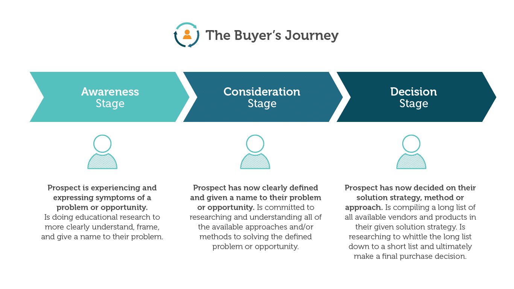

tags:: SEO

- A content audit is a process for evaluating content on a website and identifying opportunities for growth.
- ## Process
	- ### Crawl website
		- [Screaming Frog](https://www.screamingfrog.co.uk/seo-spider/) is a good tool for this purpose.
		- Get URL and title for pages with 200 status. Exclude js/css/img etc
	- ### Build buyers journey map
		- Map each page to a stage in the buyers journey (Awareness, consideration, decision).
		  collapsed:: true
			- 
	- ### Create topical map
		- Map each page to a primary topic for the website.
			- **Note orphans as possible opportunities**
	- ### Evaluate and create strategy
		- Find gaps in the buyers journey for each topic
		- Find topic gaps
		- Evaluate under/over performing pages for opportunities