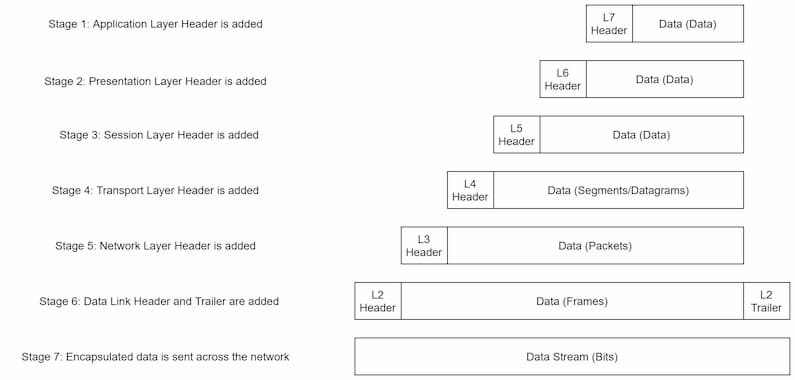

tags:: #CompSci, #Networking

- Encapsulation is the process by which data is organized, formatted, and sent from one computer to another. The process below is used when sending data and reversed when recieving (de-encapsulation). Note the different names for data as it moves through the layers. Also note that the data layer adds a header and footer. The footer is used to ensure the entire message is recieved unchanged and intact.
- 