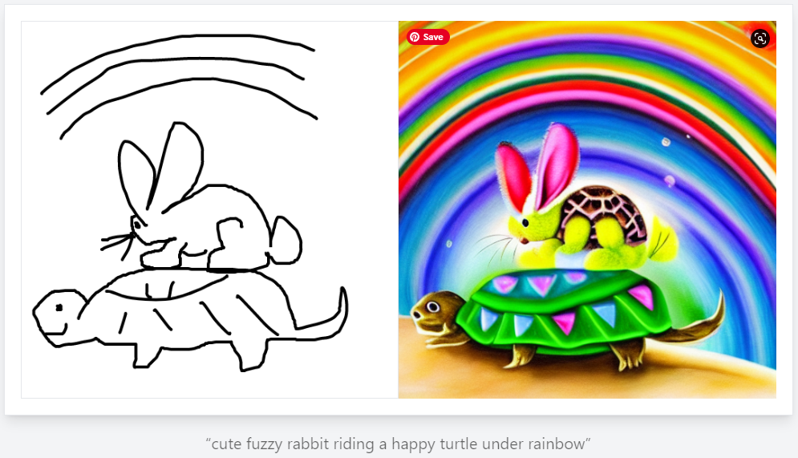

tags:: Design

- ## Tools
	- [RemoveBG](https://www.remove.bg/) - Removes image backgrounds #Graphics
	- [Online OCR](https://www.onlineocr.net/) - OCR Tool to pull text from images #OCR #Graphics
	- [Cleanup.pictures](https://cleanup.pictures/) - Cleans up  images. Awesome at removing stuff #Graphics
	- [Promo.com Image Resizer](https://promo.com/tools/image-resizer/) - Resizes images #Graphics
	- [LeiaPix](https://convert.leiapix.com/) - Converts 2D images into Lightfield Animations #Animation #Graphics
	- ((642b6cc0-6894-447e-8297-afd63e818182))
- ## Generators and Editors
	- [Scribble Diffusion](https://scribblediffusion.com/) - Tool that turns sketches into refined images #Graphics
	  id:: 63f6c7fe-b7b9-440c-9677-8ad01a45547b
		- Results were interesting
		- 
	- [Playground AI](https://playgroundai.com/) - #Graphics
	  id:: 63b65305-bff5-4887-9a88-a9bf4a5bfd0f
- ## Other
	- [ArtHub.AI](https://arthub.ai/) - Crowdsourced AI Art #Graphics
	  id:: 641517d4-8d93-46cd-84dc-9fcc81e1e7a0
-
-